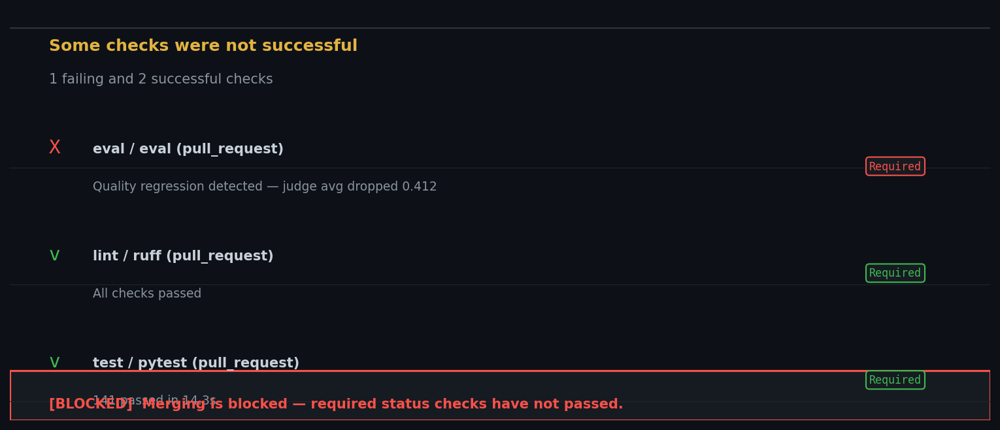
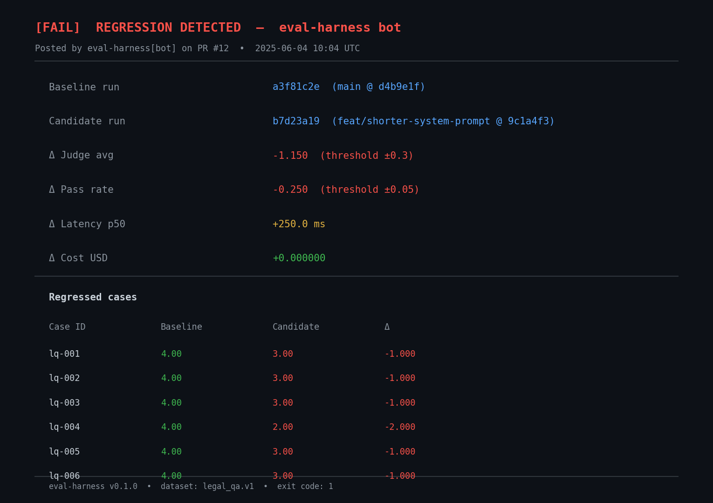
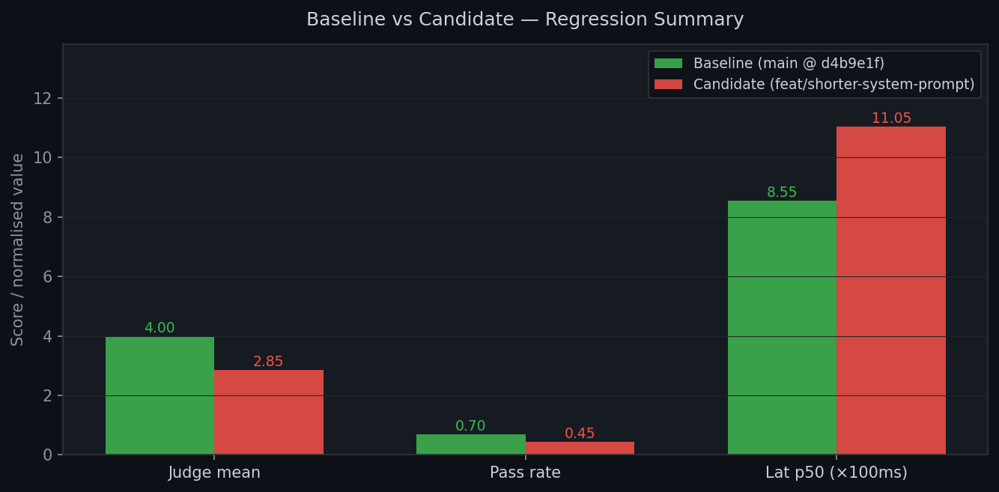

# LLM Evaluation Harness

> **Portfolio role:** the foundational project. Answers the question every production AI team asks: *"did this change make the model better or worse — and by how much?"* The other three projects in this monorepo either consume this harness or feed data into it.

---

## The problem

Prompt engineering and model selection are iterative. Without a measurement system, every iteration is a guess. This harness turns *"it seems better"* into *"judge score improved from 3.42 → 3.81 (+11%) and exact-match pass rate held at 0.73, at a cost increase of $0.002 per run"*.

The CI integration is the key deliverable: a GitHub Action that runs the full eval suite on every pull request, compares against the `main` baseline, and **blocks the merge if quality regresses beyond a configurable threshold**.

---

## Architecture

```
datasets/                  ← versioned JSONL + SHA-256 manifest
  legal_qa.v1.jsonl          60 legal Q&A test cases
  legal_qa.v1.manifest.json  hash + case count (reproducibility guarantee)

evals/
  cases.py                 ← load dataset, verify hash, filter by tag/id
  metrics/
    deterministic.py       ← exact match, regex, JSON schema validity
    aggregate.py           ← pass@k (unbiased estimator), percentiles
    judge.py               ← LLM-as-judge with structured rubric + Cohen's κ

runners/
  runner.py                ← async suite execution (httpx, semaphore concurrency)
  cli.py                   ← `eval run | compare | list`

store/
  schema.py                ← Pydantic models: TestCase, EvalRun, CaseResult, RegressionReport
  db.py                    ← SQLite persistence (aiosqlite)

report/
  compare.py               ← diff two runs → regression detected yes/no
  render.py                ← Markdown report + matplotlib charts

.github/workflows/
  eval.yml                 ← CI: run → compare → post PR comment → block merge
```

### Run flow

```
1. Load dataset (verify SHA-256)
2. For each test case × model config:
   ├── call model (async, configurable concurrency)
   ├── score deterministic metrics (no API cost)
   └── optionally score with LLM judge (rubric → JSON)
3. Persist run (input, output, scores, cost, latency, git ref)
4. Compare with baseline run on main
5. Generate Markdown report
6. If regression > threshold → exit code 1 (CI fails)
```

---

## Dataset: `legal_qa.v1`

60 legal Q&A examples across contract, tort, criminal, IP, privacy, property, and procedural law. Designed to be:
- **Reproducible**: SHA-256 hash verified at load time. Hash mismatch = test aborted.
- **Filterable**: every case has `tags` (topic + subtopic). Run a subset with `--tags contract`.
- **Extensible**: adding a new case = one JSONL line. No code change required.

```jsonl
{"id": "lq-001", "input": "What is the difference between a void and voidable contract?",
 "expected": "A void contract has no legal effect ...", "metrics": ["exact_match", "judge"],
 "tags": ["contract", "basics"]}
```

---

## Metrics

### Deterministic (zero API cost)

| Metric | Description |
|--------|-------------|
| `exact_match` | Normalised string equality (case + whitespace insensitive) |
| `regex` | Pattern match against `expected_pattern` field |
| `json_schema` | Validates model output against a Pydantic/JSON Schema |

### LLM-as-judge

The judge evaluates **four independent dimensions** using a structured rubric:

```json
{
  "correctness":      {"score": 1-5, "reasoning": "..."},
  "completeness":     {"score": 1-5, "reasoning": "..."},
  "format_adherence": {"score": 1-5, "reasoning": "..."},
  "hallucination":    {"detected": true/false, "evidence": "..."}
}
```

**Why dimensions instead of a single score?** A model can be factually correct but incomplete, or well-formatted but hallucinating. A single score hides this; dimensions expose it.

**Judge calibration:** `cohens_kappa(judge_labels, human_labels)` is implemented in `evals/metrics/judge.py`. Cite the κ on a 30-example set in your README to show the judge is validated, not blindly trusted.

**Design:** judge model is always *different from* (and stronger than) the model under evaluation. Temperature 0 on the judge for determinism.

### pass@k

Unbiased estimator from [Chen et al. 2021](https://arxiv.org/abs/2107.03374):

```python
pass_at_k(n=10, c=7, k=1)  # → 0.70
```

Useful for tasks with variance (code generation, creative writing). For legal Q&A it collapses to exact match, but the implementation is there for other domains.

---

## Example run report

```
# Eval Run Report

| Field  | Value                          |
|--------|-------------------------------|
| Run ID | `a3f81c2e`                    |
| Model  | `claude-haiku-4-5-20251001`   |
| Branch | `feat/new-system-prompt`      |
| Git ref| `d4b9e1f`                     |

## Metrics

| Metric              | Value    |
|---------------------|----------|
| Total cases         | 60       |
| Successful          | 60       |
| Pass rate           | 0.68     |
| Judge mean (1–5)    | 3.81     |
| Judge stdev         | 0.61     |
| Latency p50         | 847 ms   |
| Latency p95         | 1,203 ms |
| Total cost          | $0.0041  |
```

---

## Example regression report (CI block)

```
# Regression Report — 🔴 REGRESSION DETECTED

|                    | Value                     |
|--------------------|--------------------------|
| Baseline run       | `a3f81c2e` (main)        |
| Candidate run      | `b7d23a19` (PR #12)      |
| Δ Judge avg        | -0.412  (threshold: ±0.3)|
| Δ Pass rate        | -0.083  (threshold: ±0.05)|
| Δ Cost USD         | -0.00031                 |
| Δ Latency p50      | +12.4 ms                 |

## Regressed cases

| Case ID | Baseline | Candidate | Δ     |
|---------|----------|-----------|-------|
| lq-009  | 4.00     | 3.00      | -1.000|
| lq-014  | 3.67     | 2.67      | -1.000|
| lq-023  | 4.33     | 3.00      | -1.333|
```

### CI checks panel — merge blocked



### Regression report — PR comment



### Baseline vs Candidate comparison



---

## Quick start

```bash
cd eval-harness
pip install -e ".[dev]"
cp .env.example .env            # set ANTHROPIC_API_KEY

# Run full suite (deterministic metrics only, no judge)
eval run --dataset legal_qa --model claude-haiku-4-5-20251001

# Run with judge
eval run --dataset legal_qa --model claude-haiku-4-5-20251001 --use-judge

# Compare two branches
eval compare --baseline-branch main --candidate-branch feat/new-prompt \
             --dataset legal_qa --report-path reports/regression.md

# List recent runs
eval list --limit 10

# Run tests
python -m pytest tests/ -v
```

---

## CI integration

`.github/workflows/eval.yml` runs on every push and pull request:

1. Installs dependencies
2. Runs `eval run` against the dataset
3. On PRs: runs `eval compare` against the last completed `main` run
4. Posts the regression report as a sticky PR comment (via `marocchino/sticky-pull-request-comment`)
5. If `eval compare` exits with code 1 (regression detected), the workflow fails and the merge is blocked

```yaml
- name: Compare against baseline (main)
  if: github.event_name == 'pull_request'
  run: |
    eval compare \
      --baseline-branch main \
      --candidate-branch "${{ github.head_ref }}" \
      --threshold-judge 0.3 \
      --threshold-pass-rate 0.05
```

---

## Limits

- **Judge noise**: LLM-as-judge scores are not deterministic across models and prompt versions. Calibrate the judge (Cohen's κ) and treat single-run scores as estimates, not ground truth.
- **Dataset coverage**: 60 cases is enough for a portfolio but not production. A real system needs hundreds per subdomain.
- **Exact match is harsh**: normalised string equality misses paraphrases. For production, prefer ROUGE or BERTScore as a softer deterministic metric.
- **Cost blind spot**: the eval harness measures quality and latency but not API rate-limit behaviour or failure modes under load.
- **No multi-turn coverage**: all cases are single-turn. Conversation quality requires a different evaluation framework.

---

## Connections to other projects

- **→ 02 Local Inference**: `benchmark/quality.py` imports this harness to measure quality at each quantization level. The "quality" axis of the Pareto chart is produced here.
- **← 04 Synthetic Data**: `synthetic-data/pipeline.py` outputs JSONL in this harness's format. New examples drop straight into `datasets/`.
- **→ 03 Observability**: every `eval run` call can be instrumented with `@trace_llm` from Project 03, making cost and latency visible in the dashboard.
